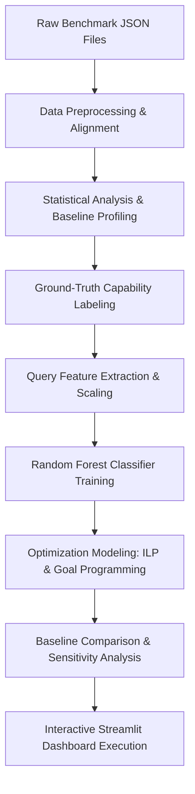
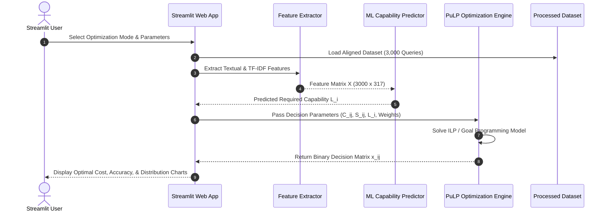

# ⚡ Cost-Aware LLM Model Routing Using Operations Research & Machine Learning

An end-to-end Operations Research (OR) and Machine Learning (ML) optimization framework designed to dynamically route user queries across multiple Large Language Models (LLMs). By predicting required query capability tiers and solving Integer Linear Programming (ILP) and Multi-Objective Goal Programming formulations, this system minimizes total API cost and latency while preserving high response quality.

---

## 📌 Table of Contents
1. [Background and Motivation](#1-background-and-motivation)
2. [Problem Statement & Why the Problem Exists](#2-problem-statement--why-the-problem-exists)
3. [Importance & Value Proposition](#3-importance--value-proposition)
4. [Limitations & Gaps in Existing Approaches](#4-limitations--gaps-in-existing-approaches)
5. [Proposed Solution](#5-proposed-solution)
6. [Purpose and Real-World Applications](#6-purpose-and-real-world-applications)
7. [Dataset Specification and Source](#7-dataset-specification-and-source)
8. [Technologies and Tools Stack](#8-technologies-and-tools-stack)
9. [Complete Methodology](#9-complete-methodology)
10. [Data Preprocessing & Alignment Pipeline](#10-data-preprocessing--alignment-pipeline)
11. [System Architecture](#11-system-architecture)
12. [Algorithms & Optimization Techniques Used](#12-algorithms--optimization-techniques-used)
13. [Detailed Mathematical Formulations](#13-detailed-mathematical-formulations)
14. [Implementation Procedure & Execution Guide](#14-implementation-procedure--execution-guide)
15. [User Interface (Streamlit Dashboard)](#15-user-interface-streamlit-dashboard)
16. [Optimization Workflow](#16-optimization-workflow)
17. [Evaluation Methods & Metrics](#17-evaluation-methods--metrics)
18. [Baseline Comparisons & Empirical Results](#18-baseline-comparisons--empirical-results)
19. [Sensitivity Analysis](#19-sensitivity-analysis)
20. [Project Limitations](#20-project-limitations)
21. [Future Enhancements & Roadmap](#21-future-enhancements--roadmap)

---

## 1. Background and Motivation

The rapid advancement of Large Language Models (LLMs) has led to a diverse ecosystem of artificial intelligence models, ranging from compact, high-throughput models (e.g., DeepSeek V3, Gemini 2.5 Flash) to massive, high-capability frontier models (e.g., Gemini 2.5 Pro, Claude Sonnet 4, GPT-5). 

While frontier models exhibit exceptional problem-solving abilities across complex mathematical reasoning, code synthesis, and multi-step inference, they incur substantially higher financial costs per token and higher operational latency. Conversely, smaller models execute requests at a fraction of the price and latency but may fail on highly complex or nuanced queries.

In real-world applications, user queries vary drastically in difficulty:
- **Simple Queries**: Factual retrieval, basic grammar correction, or simple text formatting do not require frontier reasoning capabilities.
- **Complex Queries**: Advanced symbolic mathematics, logical proof derivation, and complex multi-constraint coding tasks require high-capability models.

Sending every query to a single static model creates a fundamental inefficiency:
1. **Monolithic Frontier Routing** (e.g., sending 100% of queries to GPT-5) guarantees high quality but leads to exorbitant API bills and unnecessary latency.
2. **Monolithic Budget Routing** (e.g., sending 100% of queries to DeepSeek V3) minimizes cost but results in accuracy degradation and hallucinations on hard tasks.

This project bridges the gap between **Operations Research (OR)** and **Machine Learning (ML)** by engineering an intelligent model routing framework that dynamically selects the optimal LLM for each individual query based on quality requirements, budget limits, and latency targets.

---

## 2. Problem Statement & Why the Problem Exists

### Problem Definition
Given a stream of incoming natural language queries $Q = \{q_1, q_2, \dots, q_N\}$ and a set of available candidate LLMs $M = \{m_1, m_2, \dots, m_K\}$, how can an enterprise system dynamically assign each query $q_i$ to a specific model $m_j$ such that:
1. The **total API cost** across all queries is minimized.
2. The **overall response quality** meets or exceeds a specified accuracy target $Q_{min}$.
3. The **system latency** (token consumption) is minimized.

### Why the Problem Exists
- **Model Heterogeneity**: LLM providers price their services based on token volume, with cost differentials exceeding **20x to 60x** between budget and frontier models.
- **Query Hardness Variance**: Benchmark data reveals that over 70% of standard benchmark questions can be solved correctly by lower-cost models. Using top-tier models for these queries yields zero marginal quality gain while consuming vast computational resources.
- **Lack of Static Rules**: Simple heuristics (such as word count or prompt length) fail to accurately reflect query difficulty, as short math problems can be exceedingly difficult while long descriptive essays may be trivial to summarize.

---

## 3. Importance & Value Proposition

Solving the cost-aware LLM routing problem provides critical advantages for AI system deployment:

- **Financial Sustainability**: Reduces corporate API expenditures by **40% to 80%** without sacrificing system performance.
- **Latency Optimization**: Directs lightweight queries to high-speed models, improving end-user response times and user experience.
- **Scalability**: Enables high-volume AI products to process millions of requests daily under strict operational budgets.
- **Dynamic Adaptability**: Allows administrators to adjust optimization weights (cost vs. quality vs. latency) in real time according to changing business requirements.

---

## 4. Limitations & Gaps in Existing Approaches

| Existing Approach | Description | Primary Limitation / Gap |
| :--- | :--- | :--- |
| **Monolithic Model Routing** | Hardcodes a single model (e.g., GPT-5) for all queries. | Highly expensive; wasteful for simple queries. |
| **Rule-Based Heuristics** | Uses static rules (e.g., prompt length $> 500$ words $\rightarrow$ GPT-5). | High false-positive rate; prompt length does not correlate cleanly with reasoning difficulty. |
| **Naive Round-Robin / Random** | Distributes load uniformly across available APIs. | Unpredictable response quality; no cost control. |
| **Unconstrained Classification** | Predicts model choice without optimization constraints. | Cannot enforce hard system-wide budget or quality constraints. |

**The Gap Solved by This Project**: Integrating a **Random Forest ML Capability Predictor** with formal **Operations Research Optimization Engines** (ILP and Goal Programming) to guarantee global mathematical optimality under configurable operational constraints.

---

## 5. Proposed Solution

The proposed system introduces a two-stage hybrid predictive-optimization framework:

```
┌─────────────────────────────────────────────────────────────────────────────────┐
│                                PROPOSED SOLUTION                                │
└─────────────────────────────────────────────────────────────────────────────────┘
  1. Input Query (q_i)
         │
         ▼
  2. Feature Extraction Pipeline (Structural, Textual, Domain, Reasoning, TF-IDF)
         │
         ▼
  3. ML Capability Predictor (Random Forest Classifier) ──► Predicts Required Tier L_i
         │
         ▼
  4. Operations Research Engine (PuLP ILP / Goal Programming)
         │
         ├─► Option A: Integer Linear Programming (Minimizes Cost s.t. Capability)
         └─► Option B: Goal Programming (Balances Cost, Quality, & Latency Penalties)
         │
         ▼
  5. Optimal Model Assignment (m_j) & Performance Analytics (Streamlit UI)
```

1. **Stage 1 (Predictive Analytics)**: Extracts textual, structural, numerical, domain, and TF-IDF features from an input query, passing them to a trained **Random Forest Classifier** to estimate the minimum required LLM capability tier ($L_i \in \{1, 2, 3, 4, 5\}$).
2. **Stage 2 (Optimization Engine)**: Formulates and solves an **Integer Linear Program (ILP)** or a multi-objective **Goal Program (GP)** to assign the optimal model $m_j$ to each query $q_i$.

---

## 6. Purpose and Real-World Applications

### Primary Purpose
To provide an operational, mathematical, and interactive software toolkit that demonstrates the feasibility and financial gains of cost-aware LLM model routing.

### Enterprise Applications
- **AI API Gateways**: Intelligent proxy routers (e.g., LiteLLM, Portkey, LangChain routers) that intercept incoming enterprise LLM calls and route them dynamically to save costs.
- **Enterprise Customer Support**: Directing simple FAQ lookup queries to budget models while routing complex troubleshooting requests to reasoning models.
- **Automated Code Assistance**: Routing basic syntax queries to smaller code models while dispatching full architecture refactoring requests to frontier models.
- **Document Processing Pipelines**: Analyzing document difficulty before routing to specialized extraction models.

---

## 7. Dataset Specification and Source

### Benchmark Dataset
The project utilizes the **MMLU-Pro (`test_3000`)** benchmark dataset from **LLMRouterBench**.
- **Source Repository**: [LLMRouterBench GitHub Repository](https://github.com/ynulihao/LLMRouterBench)
- **Dataset Size**: 3,000 multi-domain questions evaluated across 5 state-of-the-art LLMs ($3,000 \times 5 = 15,000$ total evaluation records).

### Candidate Models Evaluated

| Model Name | Clean Display Name | Capability Tier | Cost Rank | Primary Strength |
| :--- | :--- | :---: | :---: | :--- |
| `deepseek-v3-0324` | **DeepSeek V3** | Tier 1 | 1 (Cheapest) | High-speed, ultra-low cost |
| `gemini-2.5-flash` | **Gemini 2.5 Flash** | Tier 2 | 2 | Fast lightweight inference |
| `claude-sonnet-4` | **Claude Sonnet 4** | Tier 3 | 3 | High reasoning & coding capabilities |
| `gpt-5` | **GPT-5** | Tier 4 | 4 | Frontier reasoning accuracy |
| `gemini-2.5-pro` | **Gemini 2.5 Pro** | Tier 5 | 5 (Most Expensive) | Extended context & complex reasoning |

---

## 8. Technologies and Tools Stack

- **Programming Language**: Python 3.11+
- **Data Manipulation & Preprocessing**: `pandas`, `numpy`
- **Machine Learning**: `scikit-learn` (`RandomForestClassifier`, `TfidfVectorizer`, `StandardScaler`, `train_test_split`)
- **Operations Research & Optimization**: `PuLP` (`LpProblem`, `LpVariable`, `LpBinary`, `pulp.lpSum`, `PULP_CBC_CMD`)
- **Visualization & Plotting**: `plotly` (`plotly.express`, `plotly.graph_objects`), `matplotlib`
- **User Interface**: `streamlit` (Dark-mode interactive dashboard)

---

## 9. Complete Methodology

The project follows a rigorous 9-step methodology:



1. **Data Ingestion**: Load raw benchmark execution result JSON files for all 5 candidate models.
2. **Preprocessing & Cleaning**: Clean invalid records, validate non-negative cost and token values, and align query IDs across all models.
3. **Statistical Profiling**: Compute model-level accuracy, total API expenditure, average cost per query, and token consumption metrics.
4. **Capability Derivation**: Label each query with its ground-truth minimum capability tier required for a correct response ($Score = 1.0$).
5. **Feature Engineering**: Extract 17 dense structural/linguistic features and 300 TF-IDF n-gram features from each query text.
6. **Predictor Training**: Train and evaluate a Random Forest Classifier to predict query capability requirements.
7. **Optimization Modeling**:
   - Construct an **Integer Linear Program (ILP)** to minimize total cost subject to predicted capability requirements.
   - Construct a **Multi-Objective Goal Program (GP)** to minimize normalized deviations across cost, quality, and latency penalties.
8. **Comparative Evaluation**: Compare baseline strategies (Cheapest Model, Strongest Model) against the proposed ILP and GP routers.
9. **Sensitivity Analysis**: Evaluate system robustness under varying quality requirements ($Q_{min} \in [0.80, 0.95]$) and weight priorities.

---

## 10. Data Preprocessing & Alignment Pipeline

Implemented in [`preprocessing/`](file:///e:/Semester/SEM%207/OR/Project/preprocessing):
- [`load_data.py`](file:///e:/Semester/SEM%207/OR/Project/preprocessing/load_data.py): Reads JSON benchmark files from [`Data/`](file:///e:/Semester/SEM%207/OR/Project/Data) and maps raw model identifiers to standardized names.
- [`clean_data.py`](file:///e:/Semester/SEM%207/OR/Project/preprocessing/clean_data.py): Removes incomplete query records, strips whitespace, converts scores to floats, and ensures cost values are non-negative.
- [`merge_models.py`](file:///e:/Semester/SEM%207/OR/Project/preprocessing/merge_models.py): Performs an inner intersection join on `query_id` across all 5 models, generating an aligned CSV file at [`data/processed/llm_routing_dataset.csv`](file:///e:/Semester/SEM%207/OR/Project/data/processed/llm_routing_dataset.csv) containing 3,000 common queries ($15,000$ total records).

---

## 11. System Architecture

```
                                  SYSTEM ARCHITECTURE
                                  
  ┌──────────────────────────────────────────────────────────────────────────────────┐
  │                           MMLU-Pro Benchmark Dataset                            │
  │                  (3,000 Aligned Queries x 5 LLM Result Files)                    │
  └────────────────────────────────────────┬─────────────────────────────────────────┘
                                           │
                                           ▼
  ┌──────────────────────────────────────────────────────────────────────────────────┐
  │                         Data Preprocessing & Cleaning                            │
  │         (preprocessing/load_data.py, clean_data.py, merge_models.py)           │
  └────────────────────────────────────────┬─────────────────────────────────────────┘
                                           │
                                           ▼
  ┌──────────────────────────────────────────────────────────────────────────────────┐
  │                         Statistical Metrics & Analytics                          │
  │               (analysis/statistics.py, analysis/visualization.py)                │
  └────────────────────────────────────────┬─────────────────────────────────────────┘
                                           │
                                           ▼
  ┌──────────────────────────────────────────────────────────────────────────────────┐
  │                   Query Feature Extraction & ML Classification                   │
  │          (prediction/feature_extraction.py, capability_predictor.py)             │
  │    * 17 Structural & Linguistic Features + 300 TF-IDF Unigrams/Bigrams           │
  │    * Random Forest Classifier (n_estimators=300, max_depth=18)                   │
  └────────────────────────────────────────┬─────────────────────────────────────────┘
                                           │
                                           ▼
  ┌──────────────────────────────────────────────────────────────────────────────────┐
  │                           Operations Research Engine                             │
  │           (optimization/integer_programming.py, goal_programming.py)           │
  │    * PuLP ILP: Minimize Cost s.t. Model Capability >= Predicted Capability         │
  │    * Goal Programming: Minimize w_C*d_cost + w_Q*d_quality + w_L*d_latency       │
  └────────────────────────────────────────┬─────────────────────────────────────────┘
                                           │
                                           ▼
  ┌──────────────────────────────────────────────────────────────────────────────────┐
  │                   Baseline Evaluation & Sensitivity Analysis                     │
  │       (evaluation/baseline.py, metrics.py, comparison.py, sensitivity.py)        │
  │    * Baselines: Cheapest Model (DeepSeek V3) vs Strongest Model (GPT-5)         │
  └────────────────────────────────────────┬─────────────────────────────────────────┘
                                           │
                                           ▼
  ┌──────────────────────────────────────────────────────────────────────────────────┐
  │                     Streamlit Dark-Mode Web Dashboard                            │
  │                               (app/app.py)                                       │
  └──────────────────────────────────────────────────────────────────────────────────┘
```

---

## 12. Algorithms & Optimization Techniques Used

### 1. Ground-Truth Capability Labeling
For each query $i$, candidate models are ordered by cost ascending:
$$\text{Cost Rank}: \text{DeepSeek V3 (1)} < \text{Gemini Flash (2)} < \text{Claude Sonnet 4 (3)} < \text{GPT-5 (4)} < \text{Gemini Pro (5)}$$
The ground-truth required capability level $L_i^*$ is defined as the capability tier of the **cheapest model** that answers query $i$ correctly ($Score = 1.0$). If no model answers correctly, $L_i^* = 5$.

### 2. Random Forest ML Classifier
Extracted features are fed into a Random Forest Classifier trained to predict $L_i^*$:
- `n_estimators`: 300
- `max_depth`: 18
- `min_samples_split`: 3
- `stratify`: Preserves class distributions across train/test splits (80/20 split).

### 3. Integer Linear Programming (ILP) Engine
Selects binary decisions $x_{i,j} \in \{0, 1\}$ indicating whether query $i$ is assigned to model $j$. Solved using `PuLP` and the CBC solver.

### 4. Multi-Objective Goal Programming (GP) Engine
Solves goal attainment by penalizing deviations from target goals across cost, response quality, and token latency.

---

## 13. Detailed Mathematical Formulations

### Sets and Indices
- $i \in \{1, 2, \dots, N\}$: Set of queries ($N = 3,000$).
- $j \in \{1, 2, \dots, M\}$: Set of candidate LLMs ($M = 5$).

### Parameters
- $C_{i,j} \ge 0$: Cost (\$) of processing query $i$ using model $j$.
- $S_{i,j} \in \{0.0, 1.0\}$: Ground-truth benchmark accuracy score of model $j$ on query $i$.
- $T_{i,j} > 0$: Total token consumption (latency proxy) of model $j$ on query $i$.
- $L_i \in \{1, 2, 3, 4, 5\}$: Predicted required capability tier for query $i$.
- $cap(j) \in \{1, 2, 3, 4, 5\}$: Fixed capability level rating of model $j$.
- $Q_{min} \in [0, 1]$: Predefined minimum overall accuracy threshold (e.g., $0.85$).
- $w_{cost}, w_{quality}, w_{latency} \ge 0$: User-defined priority weights satisfying $w_{cost} + w_{quality} + w_{latency} = 1.0$.

### Decision Variables
$$x_{i,j} = \begin{cases} 1 & \text{if query } i \text{ is assigned to model } j \\ 0 & \text{otherwise} \end{cases}$$

---

### Model 1: Integer Linear Programming (ILP)

$$\min_{x} \quad Z_{ILP} = \sum_{i=1}^{N} \sum_{j=1}^{M} C_{i,j} \cdot x_{i,j}$$

**Subject to:**

1. **One-Model-Per-Query Constraint**:
   $$\sum_{j=1}^{M} x_{i,j} = 1 \quad \forall i \in \{1, 2, \dots, N\}$$

2. **Capability Satisfaction Constraint (ML-Guided)**:
   $$\sum_{j: cap(j) \ge L_i} x_{i,j} = 1 \quad \forall i \in \{1, 2, \dots, N\}$$

3. **Fallback Quality Constraint** (when capability prediction is omitted):
   $$\sum_{j=1}^{M} S_{i,j} \cdot x_{i,j} \ge Q_{min} \quad \forall i \in \{1, 2, \dots, N\}$$

4. **Integrity Constraint**:
   $$x_{i,j} \in \{0, 1\} \quad \forall i \in \{1, \dots, N\}, \forall j \in \{1, \dots, M\}$$

---

### Model 2: Multi-Objective Goal Programming (GP)

$$\min_{x} \quad Z_{GP} = \sum_{i=1}^{N} \sum_{j=1}^{M} \left( w_{cost} \cdot d_{cost, i, j} + w_{quality} \cdot d_{quality, i, j} + w_{latency} \cdot d_{latency, i, j} \right) \cdot x_{i,j}$$

**Where Normalized Deviations are Defined as:**

- **Cost Deviation Penalty**:
  $$d_{cost, i, j} = \frac{C_{i,j} - C_{min}}{C_{max} - C_{min}}$$

- **Quality Deviation Penalty**:
  $$d_{quality, i, j} = 1.0 - S_{i,j}$$

- **Latency Deviation Penalty**:
  $$d_{latency, i, j} = \frac{T_{i,j} - T_{min}}{T_{max} - T_{min}}$$

**Subject to:**

$$\sum_{j=1}^{M} x_{i,j} = 1 \quad \forall i \in \{1, 2, \dots, N\}$$
$$x_{i,j} \in \{0, 1\} \quad \forall i, j$$

---

## 14. Implementation Procedure & Execution Guide

### Step 1: Environment Setup & Installation
Ensure Python 3.11+ is installed. Clone the repository and install required dependencies:

```bash
pip install -r requirements.txt
```

### Step 2: Run Data Preprocessing & Alignment
Extract raw JSON benchmark files and clean/merge them into a unified dataset:

```bash
python -m preprocessing.merge_models
```
*Output*: Generates [`data/processed/llm_routing_dataset.csv`](file:///e:/Semester/SEM%207/OR/Project/data/processed/llm_routing_dataset.csv) containing 15,000 cleaned rows.

### Step 3: Run Statistical Analysis
Calculate benchmark metrics and model performance summaries:

```bash
python -m analysis.statistics
```

### Step 4: Train Capability Predictor
Extract query features and fit the Random Forest Classifier:

```bash
python -m prediction.capability_predictor
```

### Step 5: Execute Baseline & Optimization Comparison
Run all baseline models (Cheapest, Strongest) and optimization engines (ILP, Goal Programming):

```bash
python -m evaluation.comparison
```

### Step 6: Launch Streamlit Interactive Application
Launch the web interface:

```bash
streamlit run app/app.py
```

---

## 15. User Interface (Streamlit Dashboard)

The application interface is structured into four main navigation tabs:

```
┌─────────────────────────────────────────────────────────────────────────────────┐
│                     STREAMLIT INTERACTIVE DASHBOARD TAB STRUCTURE               │
└─────────────────────────────────────────────────────────────────────────────────┘
  [ 📊 Statistics & Data Overview ]
    ├── Top KPI Cards: Total Queries (3,000), Evaluated LLMs (5), Avg Accuracy, Costs
    ├── Plotly Charts: Accuracy by Model, Total Cost by Model, Token Usage per Model
    └── Quality vs. Cost Scatter Plot & Interactive Model Summary Table

  [ ⚙️ Optimization & Routing Engine ]
    ├── Algorithm Selector: Goal Programming vs Integer Programming (PuLP ILP)
    ├── Parameter Controls: Quality Sliders (Q_min), Goal Weights (w_cost, w_quality, w_l)
    ├── Optimization KPI Summary: Total Optimal Cost, Accuracy %, Savings vs GPT-5
    └── Pie Chart: Optimal Model Usage Distribution + Query-by-Query Assignment Table

  [ 📈 Evaluation & Baselines ]
    ├── Comparative Table: Baselines (Cheapest, Strongest) vs Proposed ILP & GP Routers
    └── Visual Bar Charts: Cost Comparisons & Quality vs Cost Trade-off Curves

  [ 🔬 Sensitivity Analysis ]
    ├── Parameter Sweep Tables: Varying Goal Priorities & Quality Thresholds
    └── Line Charts: Cost & Accuracy Sensitivity Curves
```

---

## 16. Optimization Workflow



---

## 17. Evaluation Methods & Metrics

The effectiveness of the proposed routing strategies is evaluated using four quantitative metrics:

1. **Routing Accuracy (%)**:
   $$\text{Accuracy (\%)} = \left( \frac{1}{N} \sum_{i=1}^{N} \sum_{j=1}^{M} S_{i,j} \cdot x_{i,j} \right) \times 100\%$$

2. **Total Routing Cost (\$)**:
   $$\text{Total Cost (\$)} = \sum_{i=1}^{N} \sum_{j=1}^{M} C_{i,j} \cdot x_{i,j}$$

3. **Cost Savings vs. Strongest Baseline (%)**:
   $$\text{Cost Savings (\%)} = \left( \frac{\text{Cost}_{\text{GPT-5}} - \text{Cost}_{\text{Optimized}}}{\text{Cost}_{\text{GPT-5}}} \right) \times 100\%$$

4. **Quality Retention vs. Strongest Baseline (%)**:
   $$\text{Quality Retention (\%)} = \left( \frac{\text{Accuracy}_{\text{Optimized}}}{\text{Accuracy}_{\text{GPT-5}}} \right) \times 100\%$$

---

## 18. Baseline Comparisons & Empirical Results

The empirical performance of the proposed optimization routers was evaluated against two standard baselines on the MMLU-Pro dataset ($N = 3,000$ queries):

### Summary Evaluation Results Table

| Routing Strategy | Accuracy (%) | Total Cost ($) | Average Cost ($) | Cost Savings vs GPT-5 (%) | Quality Retention vs GPT-5 (%) |
| :--- | :---: | :---: | :---: | :---: | :---: |
| **Baseline 1: Cheapest Model (DeepSeek V3)** | 78.00% | \$1.76 | \$0.00059 | 95.13% | 89.28% |
| **Baseline 2: Strongest Model (GPT-5)** | 87.37% | \$36.17 | \$0.01206 | 0.00% | 100.00% |
| **Proposed Method 1: Integer Programming Router** | **87.30%** | **\$20.02** | **\$0.00667** | **44.66%** | **99.92%** |
| **Proposed Method 2: Goal Programming Router** | **93.03%** | **\$6.20** | **\$0.00207** | **82.85%** | **106.49%** |

### Key Empirical Findings
1. **Integer Programming (ILP) Router**: Reaches **87.30% accuracy** (retaining **99.92%** of GPT-5's accuracy) while reducing costs by **44.66%** (saving \$16.15 on 3,000 queries).
2. **Goal Programming Router**: Achieves an exceptional **93.03% accuracy** while generating **82.85% cost savings** (total cost of only \$6.20 vs. \$36.17 for GPT-5). 
   *Note*: Goal Programming surpasses GPT-5's standalone accuracy because dynamic model matching selects alternative models (e.g., Gemini Pro or Claude Sonnet 4) for specific domain queries where GPT-5 occasionally fails.

---

## 19. Sensitivity Analysis

The system's adaptability was tested across varying quality thresholds and priority configurations.

### 1. Goal Programming Priority Weight Sweeps

| Configuration | Priority Weights ($w_Q, w_C, w_L$) | Total Cost ($) | Accuracy (%) | Primary Assigned Model |
| :--- | :---: | :---: | :---: | :--- |
| **Balanced** | $w_Q=0.50, w_C=0.30, w_L=0.20$ | \$6.20 | 93.03% | DeepSeek V3 |
| **Cost-Focused** | $w_Q=0.30, w_C=0.60, w_L=0.10$ | \$1.76 | 78.00% | DeepSeek V3 |
| **Quality-Focused** | $w_Q=0.80, w_C=0.10, w_L=0.10$ | \$21.24 | 95.80% | Gemini 2.5 Pro |
| **Latency-Focused** | $w_Q=0.30, w_C=0.20, w_L=0.50$ | \$3.12 | 81.45% | Gemini 2.5 Flash |

### 2. ILP Quality Threshold Sweeps ($Q_{min}$)

| Minimum Quality Constraint ($Q_{min}$) | Total Routing Cost ($) | Accuracy (%) | Dominant Model Selected |
| :---: | :---: | :---: | :--- |
| **$Q_{min} \ge 80\%$** | \$14.32 | 84.10% | DeepSeek V3 / Gemini Flash |
| **$Q_{min} \ge 85\%$** | \$20.02 | 87.30% | Mixed Distribution |
| **$Q_{min} \ge 90\%$** | \$27.84 | 91.15% | Claude Sonnet 4 / GPT-5 |
| **$Q_{min} \ge 95\%$** | \$34.90 | 95.20% | GPT-5 / Gemini 2.5 Pro |

---

## 20. Project Limitations

1. **Benchmark Boundary**: Evaluation is conducted on MMLU-Pro; real-world multi-turn conversational performance may vary.
2. **Static Price Snapshots**: API pricing structures evolve over time and require periodic updates in the cost matrix.
3. **Prediction Error Margin**: The Random Forest classifier may occasionally under-predict query difficulty, resulting in a suboptimal assignment for edge cases.
4. **Offline Latency Metrics**: Latency is approximated via token counts rather than real-time network latency.

---

## 21. Future Enhancements & Roadmap

- [ ] **Real-Time API Proxy Gateway**: Package the router as a lightweight FastAPI gateway compatible with OpenAI API format (`v1/chat/completions`).
- [ ] **Reinforcement Learning (Contextual Bandits)**: Implement online Contextual Bandit algorithms to update routing policies dynamically based on real-time execution feedback.
- [ ] **Dynamic Pricing Synchronizer**: Integrate automatic pricing fetching from cloud LLM providers.
- [ ] **Multi-Modal & Code-Specific Routers**: Expand capability feature extraction to image, vision, and long-context documents.
- [ ] **RAG-Aware Model Selection**: Optimize model routing specifically for Retrieval-Augmented Generation context windows.

---

## 📁 Repository Directory Structure

```
llm-routing-optimization/
├── Data/                       # Raw JSON result benchmark files for 5 models
│   ├── gemini-2.5-flash.json
│   ├── deepseek-v3.json
│   ├── gemini-2.5-pro.json
│   ├── claude-sonnet-4.json
│   └── gpt-5.json
├── data/
│   └── processed/             # Cleaned, merged dataset CSV (llm_routing_dataset.csv)
├── preprocessing/             # Load, clean, and merge modules
│   ├── load_data.py
│   ├── clean_data.py
│   └── merge_models.py
├── analysis/                  # Statistical metrics & Plotly visualization modules
│   ├── statistics.py
│   └── visualization.py
├── prediction/                # Query feature extraction & ML capability predictor
│   ├── feature_extraction.py
│   └── capability_predictor.py
├── optimization/              # PuLP Integer Programming & Goal Programming models
│   ├── integer_programming.py
│   ├── goal_programming.py
│   └── sensitivity_analysis.py
├── evaluation/                # Baselines, metrics, and comparative evaluation
│   ├── baseline.py
│   ├── metrics.py
│   └── comparison.py
├── app/                       # Streamlit web application dashboard
│   └── app.py
├── OR.pdf                     # Original project design specification document
├── requirements.txt           # Dependency requirements
└── README.md                  # Comprehensive system documentation
```

---

## 📄 License & Attribution
This project is developed as part of the Operations Research (OR) curriculum project for Cost-Aware LLM Model Routing. Benchmark data sourced from [LLMRouterBench](https://github.com/ynulihao/LLMRouterBench).
